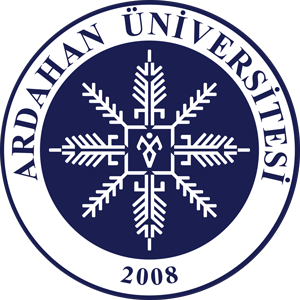

# 💻 Ardahan Üniversitesi Bilgisayar Programcılığı Öğrenme & Rehber Platformu



**Ardahan Üniversitesi Bilgisayar Programcılığı Rehberi (BP Rehberi)**, Bilgisayar Programcılığı bölümü öğrencilerinin ders içeriklerine, canlı kod pratiklerine, vize/final sınav hazırlık testlerine, zorunlu yaz stajı süreçlerine, akademik mevzuata ve şehir/kampüs rehberine tek noktadan erişebilmeleri için hazırlanmış **%100 ücretsiz, açık kaynak, reklamsız ve istemci taraflı (Vanilla HTML/CSS/JS + JSON + LocalStorage)** eğitim ve rehberlik portalıdır.

---

## 🎯 Bu Site Neden Yapıldı?

1. **Öğrencilere Tam Reberlik:** 2 yıllık (4 yarıyıl) önlisans eğitim süresince ihtiyaç duyulacak tüm akademik müfredat konularını, sınav hazırlık özetlerini ve mevzuatı tek bir çatı altında toplamak.
2. **Pratik Kodlama İmkânı:** Sunucu kurmaya veya karmaşık derleyicilere ihtiyaç duymadan, doğrudan tarayıcı üzerinden HTML, CSS, JavaScript, C#, SQL ve Python kodlarını çalıştırıp deneme imkânı sunmak.
3. **Sınav ve Staj Başarısı:** Vize ve Final sınavları öncesinde ders bazlı etkileşimli quizler çözerek başarı oranını artırmak ve **30 İş Günü Zorunlu Yaz Stajı** sürecini eksiksiz yürütmek.
4. **Şehir & Kampüs Uyum Süreci:** Ardahan'a ve Yenisey Kampüsüne yeni gelen öğrencilerin barınma (KYK/Özel Yurt), şehir içi ve otogar/havalimanı ulaşımı, iklim şartları ve günlük ihtiyaçlarına rehberlik etmek.

---

## 🗺️ Sayfa ve Bölüm Detayları (Sitede Neler Var?)

### 1. 🏠 Ana Sayfa (`#home`)
- **Karşılama & Hızlı Başlangıç:** Bölüm tanıtımı, öğrenci hayatta kalma rehberi ve hızlı erişim blokları.
- **4 Yarıyıl Müfredat Kartları:** Tüm dönem derslerinin AKTS, ders kodu, zorunlu/seçmeli durumu ve detay kartları.
- **Görsel Özellikler:** Özelleştirilebilir dikey sol menü, tema değiştirici (Aydınlık/Karanlık mod) ve 3 kademeli metin büyütme ölçeği (`A` %90 ➔ `A+` %100 ➔ `A++` %110).

### 2. 📚 Müfredat ve Ders Kataloğu (`#courses`)
- 1., 2., 3. ve 4. Yarıyıl tüm derslerin detaylı listesi.
- Active dersler (Programlama Temelleri, Veri Tabanı I, Web Tasarımının Temelleri, Bilgisayar Donanımı vb.) için detaylı konu sayfalarına doğrudan geçiş.

### 3. 📖 11 Katmanlı Detaylı Konu Anlatımı (`#lesson/:courseId/:lessonId`)
- **🎯 Öğrenme Hedefi & Konu Özeti**
- **📖 Teorik Anlatım & Şematik Yapı**
- **💡 Gerçek Hayat Senaryosu**
- **💻 Kod Örneği & Çıktısı**
- **🎓 Sınavda Bil (Vize/Final İpuçları)**
- **🚀 Sektörde Bil (İş Hayatı İpuçları)**
- **⚠️ Sık Yapılan Hatalar**
- **🛠️ Pratik Uygulama Görevi**
- **🧠 Etkileşimli Konu Sonu Quizi**
- **✅ Konu Okuma İlerleme Çubuğu & İlerleme Kaydı (LocalStorage)**

### 4. 💻 Kod Laboratuvarı & Live Sandbox (`#lab`)
- **🌐 Live HTML/CSS/JS Sandbox:** Kodları yazarken anında canlı iframe çıktısı alma.
- **⚡ JavaScript Console Runner:** Tarayıcıda JS kodlarını ve `console.log` çıktılarını canlı çalıştırma.
- **🔷 C# & 🗄️ SQL Simülatörü:** C# vize/final hazırlık kodları ve SQL sorgu simülasyonları.
- **🖥️ Derin Terminal & 520px Konsol:** Büyütülebilir ekran, net okuma fontları ve `🧹 Konsolu Temizle` düğmesi.

### 5. 🧠 Etkileşimli Quizler & Sınav Testleri (`#quizzes`)
- Ders bazlı hazırlanan çoktan seçmeli vize ve final hazırlık testleri.
- Anında doğru/yanlış cevabı görme ve **💡 Detaylı Çözüm Açıklaması**.
- Toplam çözülen test sayısı ve ortalama başarı oranı istatistik şeridi.

### 6. 💼 Kariyer & 30 İş Günü Zorunlu Yaz Stajı Rehberi (`#career`)
- **Staj Rehberi:** 30 İş Günü Zorunlu Yaz Stajı başvuru adımları, staj defteri doldurma şablonu, staj formu ve sözleşmeler.
- **Sektör Rolleri:** Yazılım Geliştirici, Web Geliştirici, Veritabanı Uzmanı, Ağ & Sistem Yöneticisi rolleri.
- **🎓 DGS Lisans Geçişi:** Bilgisayar Mühendisliği, Yazılım Mühendisliği, YBS gibi fakültelere geçiş imkânları.

### 7. 🏛️ Üniversite ve Akademik Mevzuat (`#university`)
- **UBYS İşlemleri:** Ders kayıtları, mazeret sınavları, kayıt dondurma prosedürleri.
- **Akademik Yönetmelik:** Devam zorunluluğu (Teorik %70, Uygulama %80), Vize (%40) ve Final (%60) not etki oranları, AGNO hesaplama.
- **Bölüm Altyapısı:** Ardahan TB MYO bilgisayar laboratuvar kapasiteleri (40+1 kişilik masaüstü lab, 25+1 kişilik laptop lab).

### 8. 🚌 Şehir & Kampüs Rehberi (`#city`)
- **Yenisey Kampüsü:** Hoca Ahmet Yesevi Kütüphanesi (7/24 açık), Öğrenci Yaşam Merkezi, yarı olimpik yüzme havuzu, kapalı spor salonu.
- **Barınma:** GSB KYK kız ve erkek öğrenci yurtları (Nuri Vatan KYK vb.), özel apartlar ve kiralık evlerde ısıtma/yalıtım dikkat edilecekler.
- **Ulaşım:** Şehir içi kampüs dolmuşları, Ardahan Otogarı ve Kars Harakani Havalimanı (85 km) ulaşım hatları.

### 9. 📖 Terimler Sözlüğü (`#glossary`)
- Bilişim dünyasında kullanılan **63+ teknik terim** (Algoritma, API, C#, SQL, OOP, Docker, Git, DOM, Flexbox, RAM, SSD vb.).
- Anlık arama ve kategori bazlı filtreleme.

### 10. 💡 Uygulamalı Proje Fikirleri (`#projects`)
- Başlangıç (🟢), Orta (🟡) ve İleri (🔴) düzey otomasyon ve web proje fikirleri, isterler ve veri yapıları.

### 11. 💻 Donanım Arıza Teşhis Rehberi (`#hardware-diag`)
- CPU, RAM, SSD, POST/BIOS bip sesleri ve donanım arıza giderme senaryoları.

### 12. 🖨️ Yazdırılabilir Sınav Özet Kartları (`#print-summary`)
- Sınav öncesinde ders konularının tek sayfada çıktı/PDF alınmasını sağlayan yazıcı dostu özet şablonu.

---

## 🛠️ Teknolojik Altyapı

- **Frontend:** Vanilla HTML5, CSS3 (Modern Flexbox, CSS Grid, Custom Variables, Glassmorphic UI).
- **JavaScript:** ES6+ Asenkron Fetch, Event Delegation, Custom Hash-based SPA Router (`router.js`).
- **Arama Motoru:** Türkçe karakter normalizasyonu ve alaka skoru hesaplayan gruplandırılmış arama (`search.js`).
- **Veri Depolama:** Sunucusuz, üyeliksiz, LocalStorage (`storage.js`) üzerinden ilerleme ve test skoru takibi.
- **İkonlar:** Lucide SVG İkon kütüphanesi.

---

## 📁 Proje Dizin Yapısı

```
BP-Rehberi/
│
├── index.html         # Ana HTML şablonu ve modal tanımları
├── style.css          # Tüm uygulama CSS stilleri ve responsive medya kuralları
├── README.md          # Proje dokümantasyonu
├── aru-logo.png       # Ardahan Üniversitesi resmi logosu
│
├── js/
│   ├── app.js         # Ana uygulama başlatıcı, tema, zoom ve menü dinleyicileri
│   ├── router.js      # Hash tabanlı Single Page Application (SPA) rotalandırıcı
│   ├── ui.js          # Tüm sayfa ve görünüm (view) render motoru
│   ├── storage.js     # İsim alanlı (namespaced) LocalStorage veri yönetimi
│   ├── search.js      # Türkçe uyumlu akıllı arama indeksi ve motoru
│   ├── quiz.js        # Sınav ve test değerlendirme motoru
│   ├── courses.js     # JSON veri yükleme ve önbellekleme servisi
│   └── utils.js       # HTML kaçırma, SVG ikonlar ve yardımcı araçlar
│
└── data/
    ├── courses.json   # 4 Yarıyıl ders kataloğu
    ├── glossary.json  # 63+ Teknik bilişim terimleri sözlüğü
    ├── projects.json  # Uygulamalı proje fikirleri
    │
    ├── lessons/       # Ders konu anlatımları (JSON)
    │   ├── programming.json
    │   ├── database.json
    │   ├── web.json
    │   └── hardware.json
    │
    └── quizzes/       # Ders sınav testleri (JSON)
        ├── programming.json
        ├── database.json
        ├── web.json
        └── hardware.json
```

---

## 🚀 GitHub Repository & Yayınlama

- **GitHub Reposu:** [https://github.com/cumakaya0000/cumakaya0000.github.io-bp.git](https://github.com/cumakaya0000/cumakaya0000.github.io-bp.git)

Proje tamamen istemci taraflı olduğu için GitHub Pages üzerinde doğrudan yayınlanabilir:
```bash
git add .
git commit -m "BP Rehberi tüm güncellemeler ve detaylı README eklendi"
git push origin main
```

---

## 📄 Lisans

Bu proje **MIT Lisansı** ile açık kaynak olarak sunulmaktadır. Ardahan Üniversitesi öğrencileri, akademisyenleri ve tüm bilişim meraklıları serbestçe kullanabilir, özelleştirebilir ve katkıda bulunabilir.
